# Hotel Management System

## Overview

The **Hotel Management System** is a web-based application designed to streamline hotel operations and enhance customer experience. This system provides a comprehensive solution for managing hotel bookings, rooms, employees, payments, and customer stays. It is built using **ASP.NET Core** for the backend and **React.js** for the frontend, ensuring a robust and user-friendly interface.

---

## Features

### 1. Room Management
- Add, edit, and delete rooms.
- Manage room types, amenities, and availability.
- View room details, including images and pricing.

### 2. Booking Management
- Create, update, and cancel bookings.
- Manage check-in and check-out processes.
- View booking history and details.

### 3. Employee Management
- Add, edit, and delete employee records.
- Assign roles and departments to employees.
- Manage employee statuses (e.g., active, inactive, on leave).

### 4. Payment Management
- Process payments for bookings.
- View payment history and statuses.
- Generate payment receipts.

### 5. Customer Management
- Manage customer details and identity information.
- View customer booking history.
- Search and filter customers.

### 6. Dashboard
- View real-time statistics such as:
  - Number of check-ins and check-outs.
  - Available rooms.
  - Reservations.

---

## API Endpoints

### Room Management
- `GET /api/Room` - Retrieve all rooms.
- `GET /api/Room/{id}` - Retrieve details of a specific room.
- `POST /api/Room` - Add a new room.
- `PUT /api/Room/{id}` - Update room details.
- `DELETE /api/Room/{id}` - Delete a room.

### Booking Management
- `GET /api/Booking` - Retrieve all bookings.
- `GET /api/Booking/{id}` - Retrieve details of a specific booking.
- `POST /api/Booking` - Create a new booking.
- `PUT /api/Booking/{id}` - Update booking details.
- `DELETE /api/Booking/{id}` - Cancel a booking.
- `GET /api/Booking/today-check-in` - Get today's check-ins.
- `GET /api/Booking/today-check-out` - Get today's check-outs.
- `GET /api/Booking/reservation` - Get reservation statistics.

### Employee Management
- `GET /api/Employee` - Retrieve all employees.
- `GET /api/Employee/{id}` - Retrieve details of a specific employee.
- `POST /api/Employee` - Add a new employee.
- `PUT /api/Employee/{id}` - Update employee details.
- `DELETE /api/Employee/{id}` - Delete an employee.

### Payment Management
- `GET /api/Payment` - Retrieve all payments.
- `GET /api/Payment/{id}` - Retrieve details of a specific payment.
- `POST /api/Payment` - Create a new payment.
- `PUT /api/Payment/{id}` - Update payment details.

### Customer Management
- `GET /api/Customer` - Retrieve all customers.
- `GET /api/Customer/{id}` - Retrieve details of a specific customer.
- `POST /api/Customer` - Add a new customer.
- `PUT /api/Customer/{id}` - Update customer details.

---

## Screenshots

### 1. Login Page
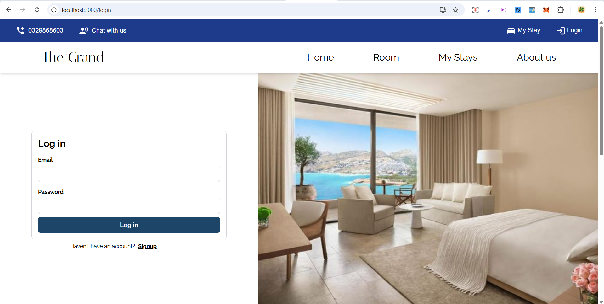

### 2. Dashboard Page
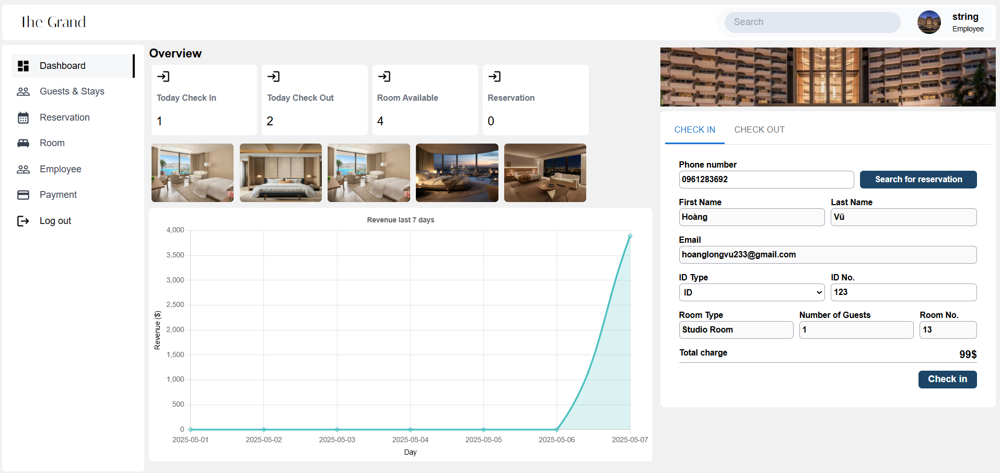

### 3. Booking Page
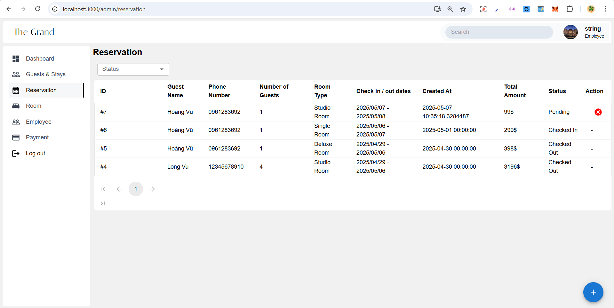

### 4. Customer Page
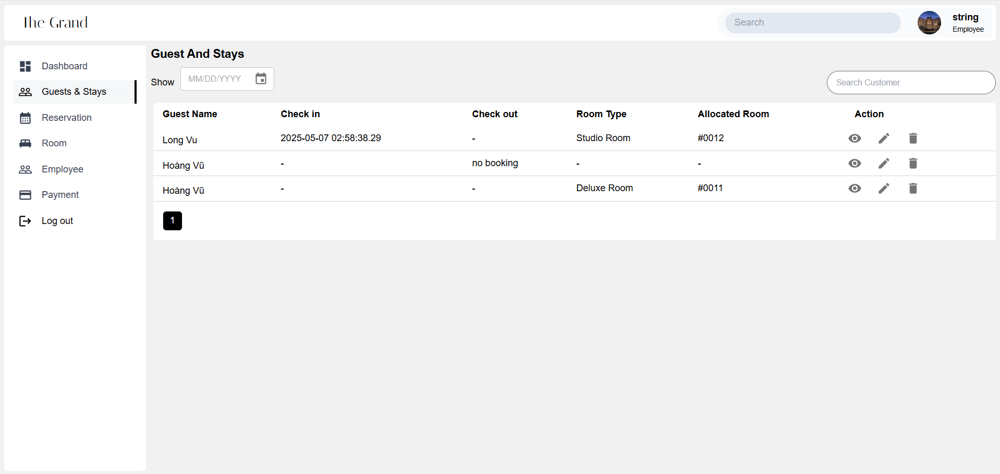

### 5. Employee Page
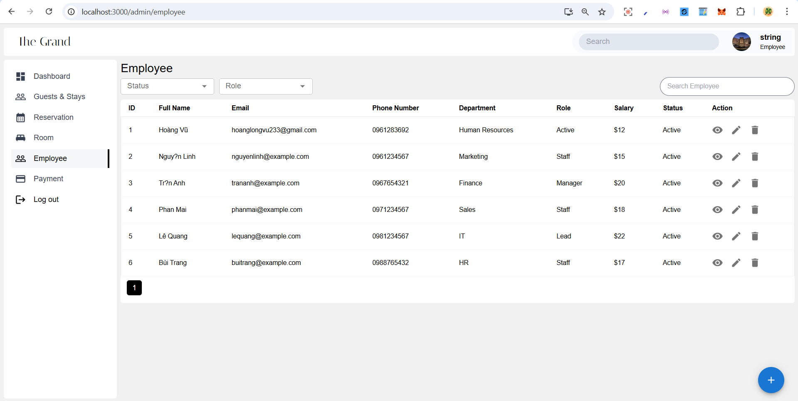

### 6. Add/Edit Booking
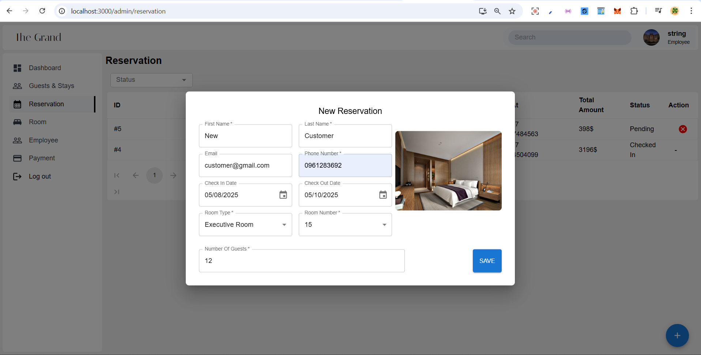

### 7. Add/Edit Employee
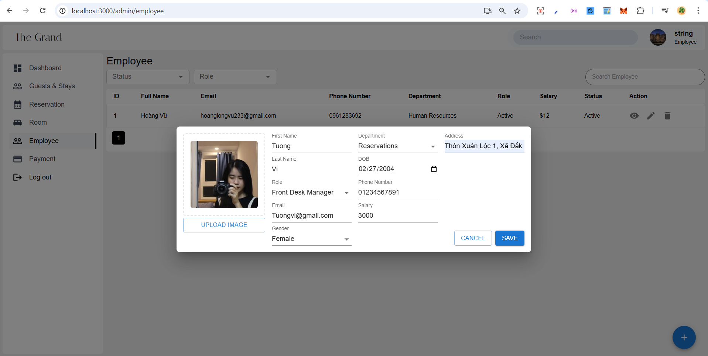

### 8. Add/Edit Room
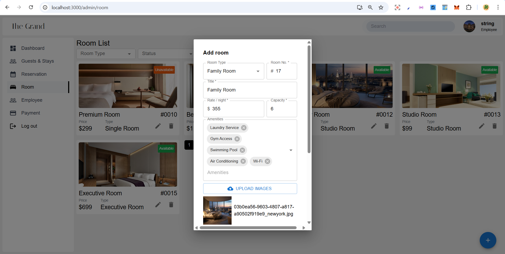

### 9. Room Page
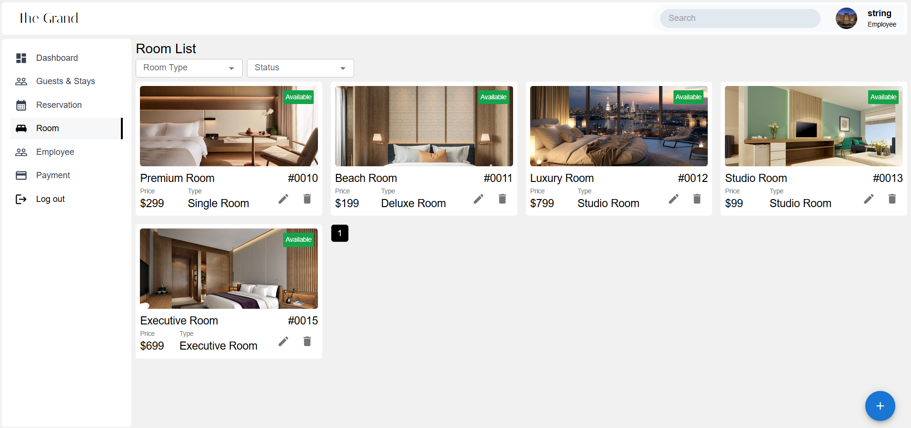

### 10. Room Details
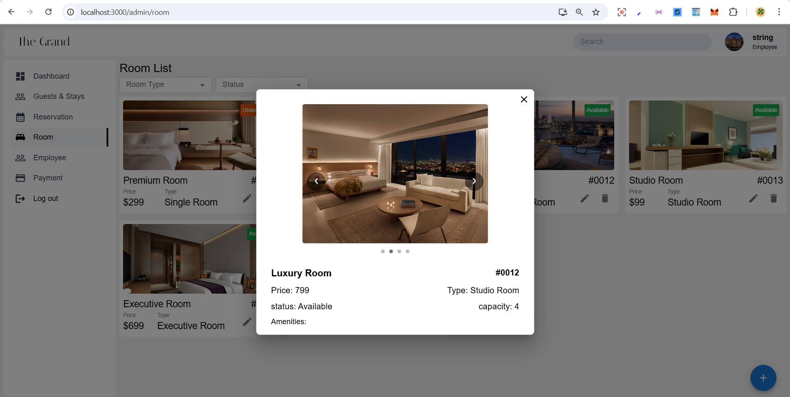

### 11. Payment Page
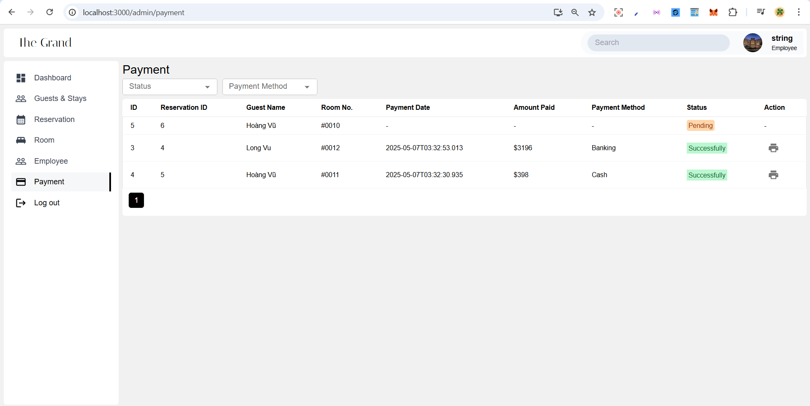

### 12. Payment Bill
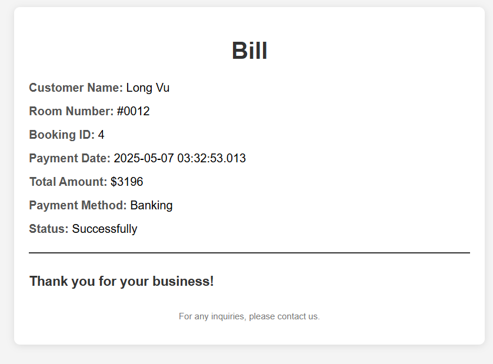

---

## Technologies Used

### Backend
- **ASP.NET Core**: For building the RESTful API.
- **Entity Framework Core**: For database management.
- **SQL Server**: As the database.

### Frontend
- **React.js**: For building the user interface.
- **Material-UI**: For modern and responsive UI components.

### Other Tools
- **Axios**: For making HTTP requests.
- **Day.js**: For date manipulation.
- **Swagger**: For API documentation.

---

## How to Run the Project

### Prerequisites
1. Install **.NET SDK** (version 8.0 or higher).
2. Install **Node.js** (version 16 or higher).
3. Install **SQL Server**.
4. Create a database named "final_dotnet" in SQL Server (or use the existing one), and uppdate the connection string in `appsettings.json`.

### Steps
1. Clone the repository:
   ```bash
   git clone https://github.com/long-vux/Hotel-Management-System.git
   cd Hotel-Management-System
   ```

2. Set up the backend:
    ```bash
    cd api
    dotnet restore
    dotnet ef database update
    dotnet run
    ```

3. Create .env file in client folder and add the following:
    ```bash
    REACT_APP_API_URL=http://localhost:5214
    ```

4. Set up the frontend:
    ```bash
    cd client
    npm install
    npm start
    ```

5. Open the application in your browser:
   - Backend: `http://localhost:5214`
   - Frontend: `http://localhost:3000`

## Contributing
Contributions are welcome! If you find any issues or have suggestions for improvements, please open an issue or submit a pull request.
